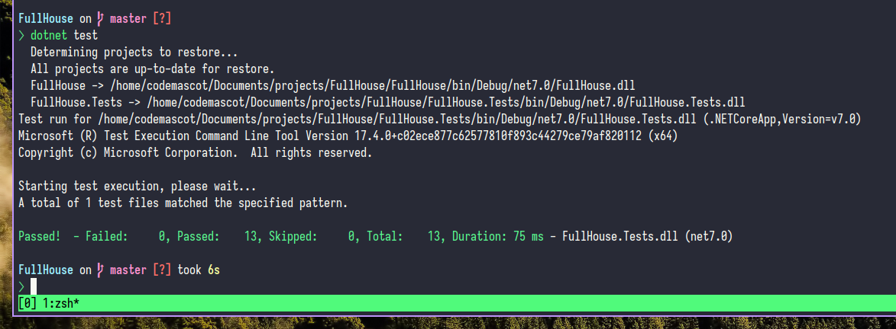

# FullHouse
A .net7 class library which tells whether the hand have *a four of a kind*, *a full house* or *neither* of them.

## Packages & Tools
- Arch Linux
- **.NET v7.0.103** 🎯 **net7.0**
- Xunit
- Moq

## Running & Test
Here TDD approach has been followed to test the functionality of this class library. Total 13 tests has been written with `Xunit` for this whole project and by using `dotnet test` command the tests can be run.

## Aknowledgement
Copyright &copy; 2023 Khan Mohammad R. - all rights reserved.

Any suggestion, pull request or bug report would be hiighly appreceated!
